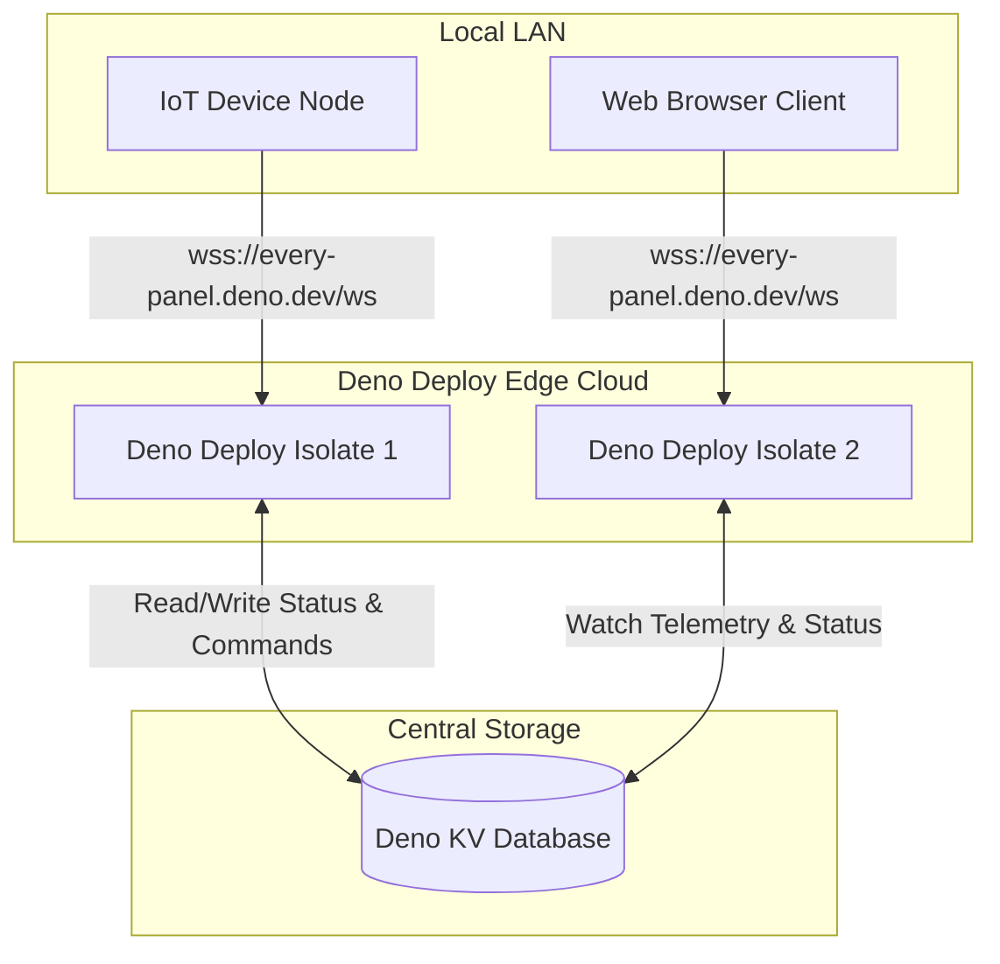
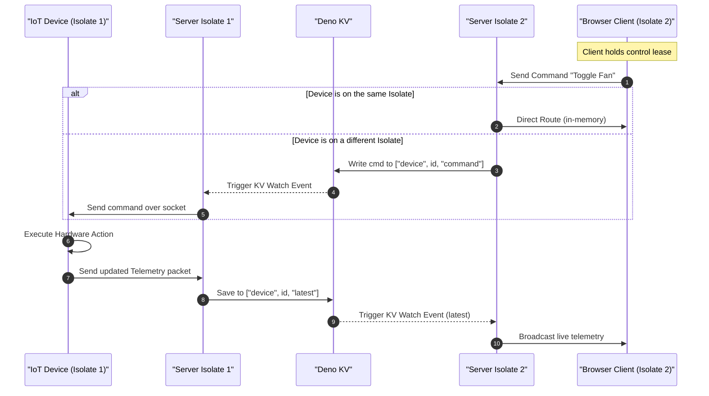
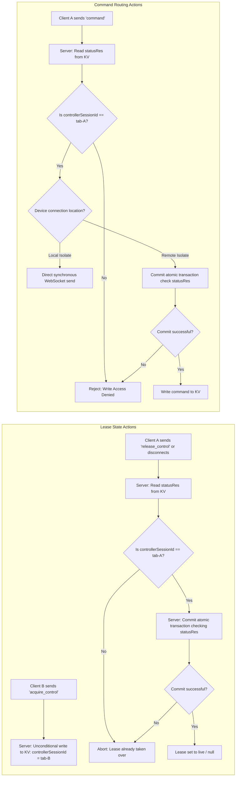
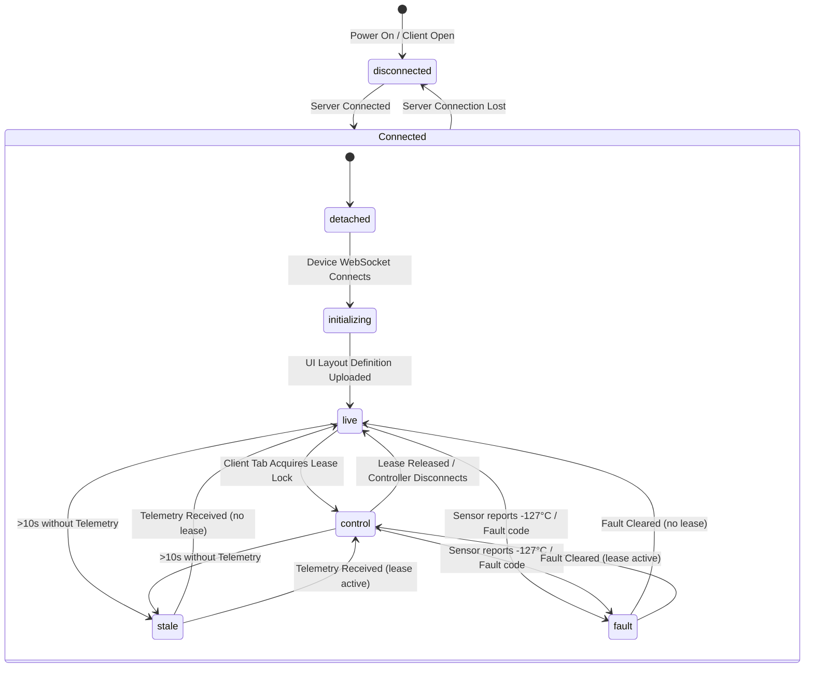

# Specification Document: Every-Panel IoT Dashboard (Deno Deploy)

This document specifies the architecture, data schemas, user interface design, and implementation details for `Every-Panel`, a single-file IoT dashboard and communication hub hosted on Deno Deploy.

---

## 1. Project Overview

`Every-Panel` is a self-configuring, lightweight, edge-native IoT management server. Unlike traditional static dashboards, `Every-Panel` does not hardcode sensor layouts. Instead, the **IoT device itself provides a UI definition** over WebSockets, which is persisted in Deno KV. The browser client then dynamically renders the control cards and telemetry gauges based on this schema.

### Core Features
*   **Edge-Isolate Scalable Architecture**: Re-engineered using stateless WebSocket connections. Leverages Deno KV Watch to sync state and commands seamlessly across distributed instances/isolates.
*   **Single-File Deployment**: The entire application (HTTP routing, WebSocket server, database access, and frontend dashboard assets) is self-contained in a single `main.ts` file.
*   **Self-Configuring UI (Device-Driven)**: Devices upload their own layout description (a JSON array of UI widgets). The server saves this in Deno KV, and the browser UI dynamically builds the dashboard at runtime.
*   **WebSocket Sub-directory**: Real-time communication is routed through `/ws`, dynamically handling connections from both IoT devices and browser clients.
*   **State Persistence (Deno KV)**: Telemetry values, historical data, and the device's UI definition are saved using Deno's built-in key-value database (`Deno.openKv()`).
*   **Seven Connection, Control and Diagnostic States**:
    *   `disconnected`: Browser client has lost connection to the server. Inputs are locked, and the status dot pulses gray while it attempts to reconnect.
    *   `detached`: The server is online, but the physical IoT device is disconnected/offline. Inputs are disabled.
    *   `initializing`: Server is connected and device is online, but the layout configuration definition hasn't been uploaded/processed yet. Badge pulses orange.
    *   `stale`: The device is online, but no telemetry packet has been received for more than 10 seconds (lagging link). Badge pulses pink.
    *   `fault`: The device has reported an error/fault message in its telemetry stream. Badge pulses rapid red, showing the error description.
    *   `live`: The IoT device is connected. Browser clients can view telemetry but cannot control outputs (view-only mode).
    *   `control`: The IoT device is connected, and one client holds the exclusive lease. Only this client is permitted to write inputs.
*   **Exclusive Lease-Lock Control**: Clients can toggle control permission. Only one browser client holds write privileges for a device at any given time.
*   **Active Server Pings**: The server polls connected devices every 5 seconds with a `ping` frame and expects a `pong` reply within 15 seconds to determine active device status.
*   **Optional & Switchable Authentication**: Authentication is optionally handled through a secure GitHub OAuth flow. Setting the environment variable `DISABLE_AUTH=true` bypasses all authentication.

---

## 2. System Architecture (Multi-Isolate Edge Deployment)

### Deployment Architecture Flow:


### Cross-Isolate Telemetry & Command Routing Sequence:


### Edge Isolate Synchronization Rules:
1.  **Telemetry Sync (`Deno.watch`)**: Server instances do not broadcast telemetry via memory maps. When telemetry is written to Deno KV on one isolate, all other isolates receive key updates reactively via `kv.watch` and push them to their local client WebSockets.
2.  **Command Routing (`Deno KV Watch`)**: Web clients send commands to their connected isolate. If the device is connected to another isolate, the server writes the command to `["device", device_id, "command"]` in Deno KV. The target isolate watches this key and pushes the command over the WebSocket to the device.
3.  **Active Lease Lock**: The control lease status is persisted in Deno KV under `["device", device_id, "status"]` (containing `controllerSessionId`). All clients watch this key to automatically lock or unlock inputs based on who holds the lease.
4.  **Disconnect Cleanup Safety (Zombie Socket Protection)**: To prevent a delayed disconnect cleanup event of a stale/dead connection (e.g., from a slow TCP socket drop-off or a delayed keepalive timeout) from overwriting a newly established connection's status as `detached` in KV, the server validates that the socket executing the close/timeout cleanup event is identical to the current active socket stored in the server's in-memory connection map.

### Atomic Concurrency & Lease Validation Flow:


---

## 3. Communication Protocol (WebSockets)

WebSocket endpoints are grouped by query parameters upon handshake:
*   **IoT Device Connection**: `/ws?role=device&device_id=my_device_1`
*   **Browser Client Connection**: `/ws?role=client&device_id=my_device_1`

### Message Types:

#### A. UI Definition Packet (Device -> Server -> KV Watch -> Clients)
Sent by the device immediately after connection to specify its layout components:
```json
{
  "type": "ui_definition",
  "device_id": "living_room_node",
  "layout_def": {
    "es-version": "0.0",
    "command": "page",
    "payload": {
      "title": "Test App",
      "type": "layout",
      "properties": { "id": "layout_rows", "flow": "row" },
      "layout": [
        // widget list
      ]
    }
  }
}
```

#### B. Telemetry Packet (Device -> Server -> KV Watch -> Clients)
Sent by the device when values change or periodically:
```json
{
  "type": "telemetry",
  "device_id": "living_room_node",
  "data": {
    "temp_sensor": 22.5,
    "light_state": 350,
    "relay_1": false
  },
  "timestamp": 1693000000000
}
```

#### C. Heartbeat Pings (Server -> Device)
Periodic ping frame issued every 5 seconds by the local isolate hosting the device:
```json
{ "type": "ping" }
```
The device must respond within 15 seconds with a pong frame:
```json
{ "type": "pong" }
```

#### D. Lease Acquisition Packets (Client <-> Server)
Clients query lease acquisition by sending:
```json
{ "type": "acquire_control", "device_id": "living_room_node" }
```
Clients release control by sending:
```json
{ "type": "release_control", "device_id": "living_room_node" }
```

#### E. Status Update Broadcasts (Server -> Clients)
Pushed whenever device connections or lease statuses transition:
```json
{
  "type": "status_update",
  "device_id": "living_room_node",
  "state": "detached" | "live" | "control",
  "is_controller": true | false
}
```

---

## 4. Database Schema (Deno KV)

*   **UI Definition**: Stores the widget schema uploaded by the device.
    *   *Key*: `["device", device_id, "ui_definition"]`
    *   *Value*: `{ layoutDef: {...}, timestamp: number }`
*   **Latest Telemetry**: Store the latest values received for a device.
    *   *Key*: `["device", device_id, "latest"]`
    *   *Value*: `{ data: { ... }, timestamp: number }`
*   **Device Connection Status & Lease**: Tracks connectivity and locks.
    *   *Key*: `["device", device_id, "status"]`
    *   *Value*: `{ state: "detached" | "live" | "control", controllerSessionId: string | null }`
*   **Telemetry History**: Store historical data for charts.
    *   *Key*: `["device", device_id, "history", timestamp]`
    *   *Value*: `{ data: { ... }, timestamp: number }`
*   **Command Routing Key**: Stores the latest command packet to trigger the device's watch listener.
    *   *Key*: `["device", device_id, "command"]`
    *   *Value*: `{ type: "command", device_id: string, action: string, target: string, value: any }`
*   **Active Sessions**: Store validated UI login sessions.
    *   *Key*: `["sessions", session_id]`
    *   *Value*: `{ username: string, expires: number }`

---

## 5. Connection & Control State Machine

This state machine defines the lifecycle transitions of the overall system state (synchronized across Deno Deploy isolates via Deno KV and signaled to clients via WebSocket protocols):



---

## 6. UI/UX & Dynamic Rendering Guidelines

The dashboard page is served directly by `main.ts` as an embedded template literal, featuring:
*   **Dynamic Card Generation**: When a client connects, the UI queries the current device schema (`ui_definition`). It clears the panels container and renders sensor and switch cards dynamically.
*   **Interactive Status States**:
    *   `detached`: Color indicator is Red. Controls are hidden and inputs disabled.
    *   `live`: Color indicator is Yellow. Action button displays "Acquire Control", and interactive inputs (sliders, buttons, switches) are selectively disabled and dimmed (sensor displays and charts remain fully sharp and readable).
    *   `control`: Color indicator is Green. Action button displays "Release Control". Widgets are active and interactive if this client holds the lease.
*   **Glassmorphism Theme**: Sleek dark mode using background blur, semi-transparent panels, and glowing card headers.
*   **Live Charts**: Line graphs plotting sensor values over time fetched via the `/api/history` endpoint.
### 6.1 Deno Deploy Specifications
*   **Entry Point**: `src/main.ts` serves as the primary router and HTTP listener module.
*   **Virtual File System**: Standard filesystem APIs (e.g., `Deno.readTextFile`) resolve assets relative to the repository workspace root under Deno Deploy's continuous integration layer, allowing dynamic retrieval of static files inside the `public/` directory.
*   **Zero-Config managed KV**: In cloud environments, initializing `Deno.openKv()` with an undefined path automatically binds the client instance to the platform's distributed production-grade Deno KV cloud instance.
*   **Environment Variable Mappings**: All authentication policies, secrets, and authorization boundaries are populated via standard environment variables:
    *   `DISABLE_AUTH`: `"true"` (bypass logins) or `"false"` (enforce logins).
    *   `GITHUB_CLIENT_ID` / `GITHUB_CLIENT_SECRET`: GitHub OAuth app keys.
    *   `ALLOWED_GITHUB_USERS`: Whitelist for directory dashboard views.

---

## 7. Future Enhancements & TODOs
*   [ ] **Security Mechanism with App Key**: Implement a shared application key verification mechanism for both IoT devices and client browser connections to prevent unauthorized dashboard discovery and session hijacking.
*   [ ] **Public Panels**: Allow devices to publish their dashboards as public, read-only panels that can be viewed by unauthenticated users, while keeping control leases restricted to authorized sessions.
*   [ ] **Integration Tests for Mock Authentication**: Implement an integration test suite validating the authorization boundary using a dummy login interface (mock developer auth flow) enabled via a dedicated environment variable switch (e.g., `MOCK_AUTH=true`) to test authentication states without querying the live GitHub API.
*   [ ] **Create GitHub Repository**: Set up a public GitHub repository for the Every-Panel project, including automated Deno Deploy workflow integrations for continuous deployment upon git push actions.
*   [x] **Refactor into Multi-File Deno Project**: Split the monolithic `main.ts` codebase (currently ~2,000 lines) into a modular, clean multi-file Deno project structure (e.g., separating the DB controllers, HTTP routers, authentication middleware, WebSocket handlers, and static HTML templates).
*   [ ] **Comprehensive Deployment and Hardware Guide**: Add detailed examples and documentation outlining (1) [x] the step-by-step setup configuration for Deno Deploy (environment variables, Deno KV activation) and (2) [ ] the physical ESP32 hardware wiring description (DS18B20 1-Wire pinout connections, GPIO26 wiring, and pull-up resistor requirements).
*   [ ] **Mobile-Friendly UI Optimization**: Optimize the Glassmorphism layout for small screens and mobile devices, introducing touch-optimized controls (larger tap targets, slider thumb adjustments), responsive flex-wrap cards, and smooth pull-to-refresh gestures.
*   [ ] **Refine Telemetry History Charts**: Enhance the historical line chart visualizer in the panel UI, adding custom time-range selectors (1 hour, 24 hours, 7 days), zooming and panning features, multi-metric axis support, and clean hovering tooltips.
*   [ ] **Server-Side Telemetry Downsampling & Aggregation Policy**: Implement a configurable storage interval policy on the server to downsample historical database logs. Instead of writing every raw telemetry message to Deno KV, buffer incoming data points over a time interval (e.g., 1 minute or 5 minutes) and write a single consolidated data point storing the `min`, `max`, `average`, and `latest` values for each sensor during that time slice.
*   [ ] **Characterise Deno Deploy reliablity**
